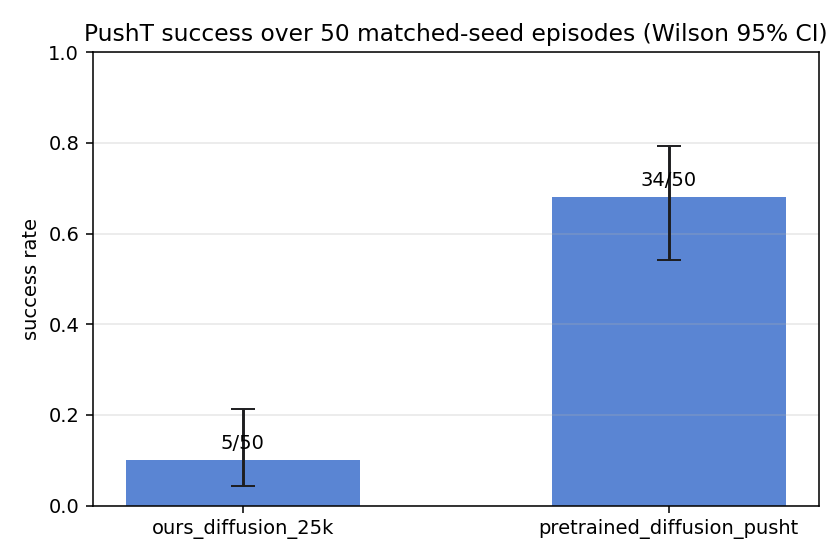
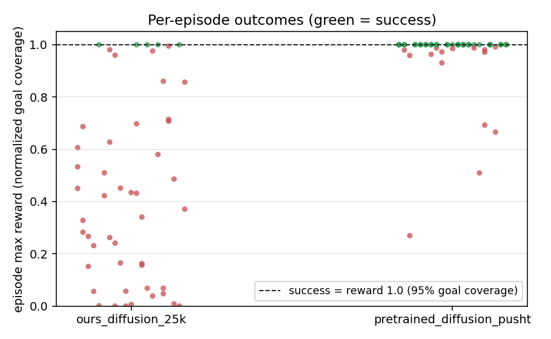
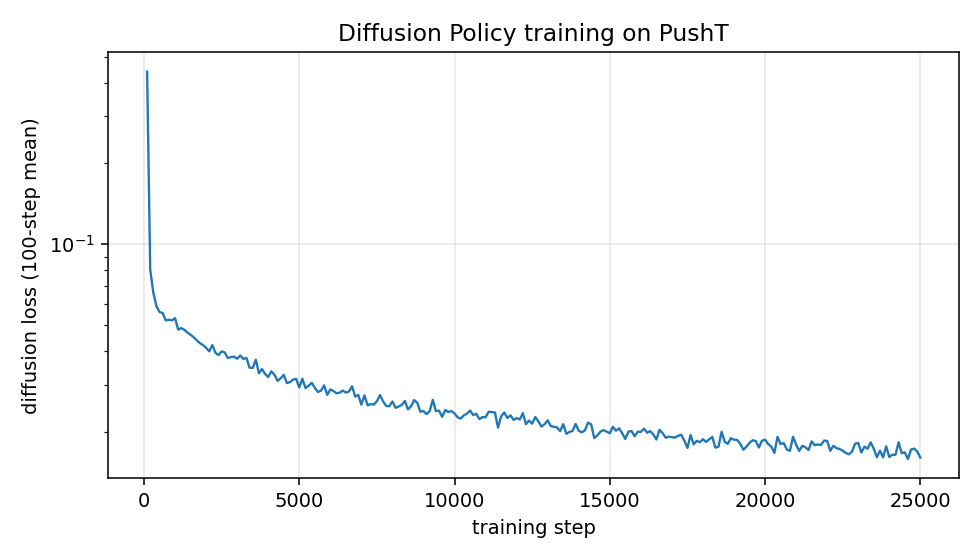
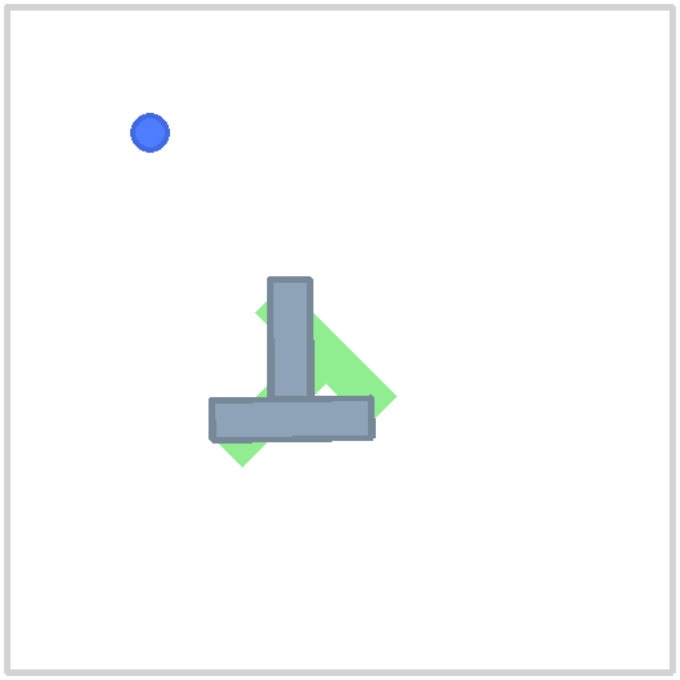

# robot-imitation-lab

[](https://github.com/gradientsj/robot-imitation-lab/actions/workflows/ci.yml)

**Imitation-learning robot policies on open data: train a Diffusion Policy
from human demonstrations on PushT, evaluate it with confidence intervals,
and compare against the pretrained reference checkpoint under a matched
protocol.** Plus a link-verified survey of the open VLA model landscape
([docs/vla-landscape.md](docs/vla-landscape.md)).

Everything runs on open Hugging Face assets: the
[`lerobot/pusht`](https://huggingface.co/datasets/lerobot/pusht) dataset
(206 human demonstrations, 25,650 frames), the
[`lerobot/diffusion_pusht`](https://huggingface.co/lerobot/diffusion_pusht)
reference checkpoint, and the [LeRobot](https://github.com/huggingface/lerobot)
library (0.4.x), trained and evaluated on a single RTX 4090.

## Results

Both policies, same architecture (262M-parameter Diffusion Policy), same
data, same evaluation: 50 rollouts in gym-pusht with identical seeds, a
300-step limit, and success defined by the environment (95% goal coverage).

| Policy | Training | Success rate | Wilson 95% CI | Mean max reward |
|---|---|---|---|---|
| `ours_diffusion_25k` | 25k steps (~2 h on one 4090) | **10%** (5/50) | 4% - 21% | 0.445 |
| `lerobot/diffusion_pusht` | 200k steps | **68%** (34/50) | 54% - 79% | 0.957 |

Two readings of this table, both deliberate:

1. **The protocol is validated.** The reference checkpoint reports 65.4%
   success / 0.955 avg max reward on its model card (500 episodes). Our
   independent 50-episode protocol lands at 68% / 0.957, inside the CI of
   the published number. An evaluation harness that cannot reproduce a known
   result cannot be trusted to compare anything.
2. **Training compute is quantified honestly.** Our run used exactly 1/8 of
   the reference's optimization budget (25k vs 200k steps, same batch size
   64 and lr 1e-4; the reference additionally used a 500-step warmup
   scheduler). The gap is the cost of that budget, measured under matched
   conditions rather than estimated.



The per-episode picture says more than the rates. The undertrained policy
shows the full failure spectrum (clean successes, near-misses, partial
pushes, whiffs), while the reference is essentially bimodal at the top:



Training loss, for the record (log scale, 100-step means):



Rollouts (left: ours at 25k steps; right: the 200k-step reference, same seed):

| ours | pretrained reference |
|---|---|
|  |  |

Raw per-episode records: [`results/ours_diffusion_25k/eval.json`](results/ours_diffusion_25k/eval.json),
[`results/pretrained_diffusion_pusht/eval.json`](results/pretrained_diffusion_pusht/eval.json).
Training log and config snapshot: [`results/training_log.csv`](results/training_log.csv),
[`results/train_config.json`](results/train_config.json).

## Two failure modes this project had to catch

Both lived in normalization, both failed silently, and both are recorded in
the commit history as they happened:

1. **The loss can lie.** LeRobot 0.4.x moved normalization out of the policy
   into processor pipelines; the older `dataset_stats` constructor kwarg is
   silently swallowed. A loop wired the old way trains on raw pixel
   coordinates, and the diffusion loss still goes down. Only rollouts expose
   it. Consequence in the design: every batch goes through the preprocessor
   explicitly, and the processor pipelines are saved next to the weights so
   a checkpoint is a complete, self-describing artifact.
2. **Normalization stats are part of a checkpoint's contract.** The
   reference checkpoint normalizes images with ImageNet statistics, not
   PushT dataset statistics (mean ~0.97: the board is mostly white).
   Rebuilding normalization from dataset stats degraded it from 65% to 4%
   success while it still pushed the block to 0.66 mean coverage, which is
   exactly what makes the failure dangerous: it reads as "mediocre policy,"
   not "broken pipeline." The evaluator therefore resolves normalization in
   priority order: processors saved with the checkpoint, then stats embedded
   in old-format state dicts (extracted, unit tested), then dataset stats
   with a warning.

## Quickstart

Requires [uv](https://docs.astral.sh/uv/) and ideally an NVIDIA GPU (CUDA
12.8 wheels are pinned for Windows; evaluation alone also works, slowly, on
CPU).

```bash
uv sync --extra dev
uv run pytest                  # 9 tests, CPU-only (metrics, parsing, reports)

# train from scratch (~2 h on an RTX 4090)
uv run imitlab-train --steps 25000 --num-workers 8 --out-dir outputs/train/diffusion_pusht_25k

# evaluate both policies on identical seeds
uv run imitlab-eval --checkpoint outputs/train/diffusion_pusht_25k/checkpoint --name ours_diffusion_25k
uv run imitlab-eval --checkpoint lerobot/diffusion_pusht --name pretrained_diffusion_pusht

# figures
uv run imitlab-figures results/ours_diffusion_25k/eval.json results/pretrained_diffusion_pusht/eval.json --train-log outputs/train/diffusion_pusht_25k/training_log.csv
```

CI runs lint and the unit tests CPU-only; training and rollouts happen on
real hardware and their outputs are committed under `results/`.

## The VLA survey

[docs/vla-landscape.md](docs/vla-landscape.md) maps the open robot
foundation model landscape as of June 2026: GR00T N1 through N1.7, pi0 /
pi0-FAST / pi0.5, RDT-1B and RDT2, OpenVLA and OpenVLA-OFT, Octo, SmolVLA,
WALL-OSS, CogACT, SpatialVLA, and MolmoAct, organized by action-head
taxonomy (discrete tokens, FAST tokens, diffusion, flow matching), with
licensing notes and a "what fine-tunes on a 24 GB consumer GPU" table. Every
HF repo id was verified to resolve; unverifiable claims are flagged.

The connection to this repo: diffusion/flow-matching action heads are what
those 3B-parameter models use to produce motor commands. Training one from
scratch at PushT scale is the cheapest honest way to build intuition for
their design choices (observation history, action horizon, chunk-prefix
execution) and for the evaluation variance that makes success-rate
comparisons without confidence intervals meaningless.

## Repository layout

```
src/imitlab/
  train.py      # compact Diffusion Policy training loop (lerobot 0.4.x API)
  evaluate.py   # matched-seed rollout eval; normalization provenance chain
  figures.py    # success comparison, outcome distribution, loss curve
  metrics.py    # Wilson intervals + episode summaries (pure Python, tested)
  report.py     # markdown comparison table
docs/
  vla-landscape.md            # the open VLA model survey
results/
  ours_diffusion_25k/         # our policy: eval.json + rollout GIFs
  pretrained_diffusion_pusht/ # reference: eval.json + rollout GIFs
  figures/                    # committed PNGs used above
  training_log.csv            # 25k-step loss/throughput log
  train_config.json           # exact run configuration
tests/                        # 9 CPU-only tests
```

## Limitations and next steps

One task, one embodiment, in simulation, 50-episode evaluation: the CIs in
the table are the honest width of what this measures. Next steps in rough
priority order:

1. **Compute-matched run**: train to 200k steps (~14 h on the 4090) with the
   reference's warmup schedule and confirm we close the gap to ~65%.
2. **Tighter evaluation**: 200-500 episodes to shrink the CIs before making
   any finer-grained claims.
3. **A VLA fine-tune**: SmolVLA (0.5B, designed for consumer GPUs) on a
   LeRobot community dataset, connecting the survey to practice.
4. **A second task/embodiment** (ALOHA sim transfer-cube) to test that the
   harness generalizes beyond PushT.

## License

MIT
