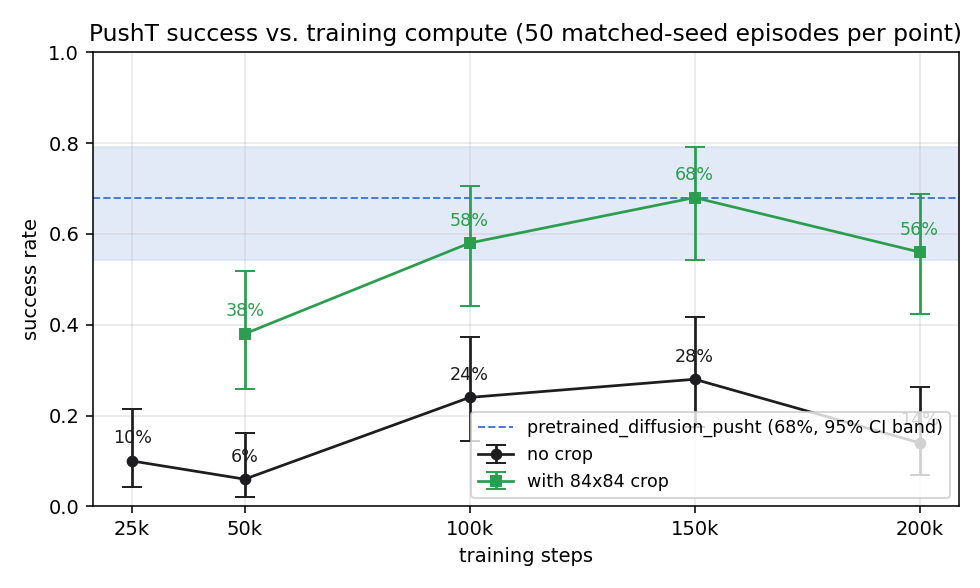
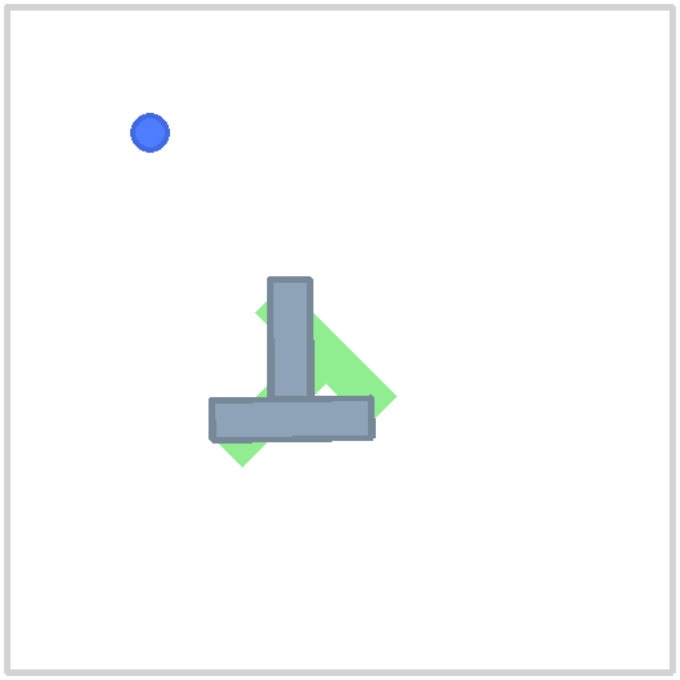

# robot-imitation-lab

[](https://github.com/gradientsj/robot-imitation-lab/actions/workflows/ci.yml)

**Imitation-learning robot policies on open data: train a Diffusion Policy
from human demonstrations on PushT, evaluate it with confidence intervals,
and compare against the pretrained reference checkpoint under a matched
protocol.** Plus a link-verified survey of the open VLA model landscape
([docs/vla-landscape.md](docs/vla-landscape.md)).

Everything runs on open Hugging Face assets: the
[`lerobot/pusht`](https://huggingface.co/datasets/lerobot/pusht) dataset
(206 human demonstrations, 25,650 frames), the
[`lerobot/diffusion_pusht`](https://huggingface.co/lerobot/diffusion_pusht)
reference checkpoint, and the [LeRobot](https://github.com/huggingface/lerobot)
library (0.4.x), trained and evaluated on a single RTX 4090.

## Results

Both policies, same architecture (262M-parameter Diffusion Policy), same
data, same evaluation: 50 rollouts in gym-pusht with identical seeds, a
300-step limit, and success defined by the environment (95% goal coverage).

The experiment ran in three acts, all evaluated on the same 50 seeds:

| Policy | Training | Success rate | Wilson 95% CI | Mean max reward |
|---|---|---|---|---|
| `ours_diffusion_25k` | 25k steps, constant lr, no crop (~2 h) | 10% (5/50) | 4% - 21% | 0.445 |
| `ours_diffusion_200k` | 200k steps, cosine + warmup, no crop (~14 h) | 14% (7/50) | 7% - 26% | 0.595 |
| `ours_crop_200k` | 200k steps, same + **84x84 crop aug** (~14 h) | **56%** (28/50) | 42% - 69% | 0.945 |
| `lerobot/diffusion_pusht` | 200k steps, reference recipe | **68%** (34/50) | 54% - 79% | 0.957 |



Milestone checkpoints of both 200k runs trace the full curves (milestones
are snapshots of one cosine schedule, so their learning rate had not
finished decaying at the time of saving):

| Steps | No crop | With 84x84 crop |
|---|---|---|
| 50k | 6% (2% - 16%) | 38% (26% - 52%) |
| 100k | 24% (14% - 37%) | 58% (44% - 71%) |
| 150k | 28% (17% - 42%) | **68%** (54% - 79%) |
| 200k | 14% (7% - 26%) | 56% (42% - 69%) |

Three readings, in the order they happened:

1. **The protocol is validated.** The reference checkpoint reports 65.4%
   success / 0.955 avg max reward on its model card (500 episodes). Our
   independent 50-episode protocol lands at 68% / 0.957, inside the CI of
   the published number. An evaluation harness that cannot reproduce a known
   result cannot be trusted to compare anything.
2. **Steps alone did not close the gap.** At the full 200k budget with the
   reference's batch size, learning rate, and warmup schedule, the no-crop
   run reached only 14%, and its final checkpoint scored *below* its own
   150k milestone while training loss fell monotonically to 0.0020. Diffing
   the two checkpoints' configs pinpointed the difference: the reference
   trained with random 84x84 crop augmentation (`crop_shape: [84, 84]`),
   while LeRobot 0.4.x defaults `crop_shape` to `None`, so the run had no
   image augmentation at all. On 206 demonstrations, that is a recipe for
   the vision encoder to memorize the training frames, and a success curve
   that peaks mid-run and regresses while the loss keeps improving is what
   that looks like from the outside.
3. **Restoring the one missing ingredient confirmed the diagnosis.**
   Re-running the identical recipe with `--crop-size 84` lifted every
   milestone by 30+ points and put the curve inside the reference's CI band
   from 100k steps onward (58%, 68%, 56% at 100k/150k/200k vs the
   reference's 54% - 79%). The final checkpoints differ by 56% vs 68% with
   heavily overlapping intervals, which 50 episodes cannot separate; whether
   any daylight actually remains is exactly what next step #1 (a wider
   evaluation) exists to answer. One config default was worth a factor of
   four in task success, and no training-side metric hinted at it.


The per-episode picture says more than the rates. The no-crop checkpoints
show the full failure spectrum (clean successes, near-misses, partial
pushes, whiffs); the crop run's distribution converges toward the
reference's bimodal shape at the top:


Training loss for the crop run, for the record; nothing in a curve like
this distinguishes a 14% policy from a 56% one, which is the recurring
lesson of this repo (log scale, 100-step means):


Rollouts on the same seed (left to right: ours at 25k, ours at 200k without
crop, ours at 200k with crop, the reference):

| ours 25k | ours 200k no crop | ours 200k crop | pretrained reference |
|---|---|---|---|
|  |  |  |  |

Raw per-episode records live in `results/<run>/eval.json` for all ten
evaluations. Training logs and config snapshots are committed per run:
`results/training_log*.csv` / `results/train_config*.json` (25k, 200k
no-crop, and 200k crop).

## Three failure modes this project had to catch

All three failed silently, and all three are recorded in the commit history
as they happened:

1. **The loss can lie.** LeRobot 0.4.x moved normalization out of the policy
   into processor pipelines; the older `dataset_stats` constructor kwarg is
   silently swallowed. A loop wired the old way trains on raw pixel
   coordinates, and the diffusion loss still goes down. Only rollouts expose
   it. Consequence in the design: every batch goes through the preprocessor
   explicitly, and the processor pipelines are saved next to the weights so
   a checkpoint is a complete, self-describing artifact.
2. **Normalization stats are part of a checkpoint's contract.** The
   reference checkpoint normalizes images with ImageNet statistics, not
   PushT dataset statistics (mean ~0.97: the board is mostly white).
   Rebuilding normalization from dataset stats degraded it from 65% to 4%
   success while it still pushed the block to 0.66 mean coverage, which is
   exactly what makes the failure dangerous: it reads as "mediocre policy,"
   not "broken pipeline." The evaluator therefore resolves normalization in
   priority order: processors saved with the checkpoint, then stats embedded
   in old-format state dicts (extracted, unit tested), then dataset stats
   with a warning.
3. **Defaults drift across library versions.** The reference recipe trained
   with random 84x84 crop augmentation; LeRobot 0.4.x changed the
   `crop_shape` default to `None`, so a training run written against current
   defaults silently loses the augmentation the published results depend on.
   Nothing fails, the loss improves, and task success quietly stalls then
   regresses (28% at 150k steps, 14% at 200k). The config diff between
   checkpoints is what surfaced it, and a controlled re-run with the single
   flag restored (`--crop-size 84`) confirmed it: 56% at the same budget,
   inside the reference's CI band. An argument for always committing config
   snapshots next to results.

## Quickstart

Requires [uv](https://docs.astral.sh/uv/) and ideally an NVIDIA GPU (CUDA
12.8 wheels are pinned for Windows; evaluation alone also works, slowly, on
CPU).

```bash
uv sync --extra dev
uv run pytest                  # 9 tests, CPU-only (metrics, parsing, reports)

# train from scratch (~2 h on an RTX 4090); the full reference recipe is
# 200k steps with warmup and crop augmentation (~14 h):
uv run imitlab-train --steps 25000 --num-workers 8 --out-dir outputs/train/diffusion_pusht_25k
uv run imitlab-train --steps 200000 --num-workers 8 --warmup-steps 500 --crop-size 84 --save-every 50000 --out-dir outputs/train/diffusion_pusht_200k_crop

# evaluate both policies on identical seeds
uv run imitlab-eval --checkpoint outputs/train/diffusion_pusht_25k/checkpoint --name ours_diffusion_25k
uv run imitlab-eval --checkpoint lerobot/diffusion_pusht --name pretrained_diffusion_pusht

# figures
uv run imitlab-figures results/ours_diffusion_25k/eval.json results/pretrained_diffusion_pusht/eval.json --train-log outputs/train/diffusion_pusht_25k/training_log.csv
```

CI runs lint and the unit tests CPU-only; training and rollouts happen on
real hardware and their outputs are committed under `results/`.

## The VLA survey

[docs/vla-landscape.md](docs/vla-landscape.md) maps the open robot
foundation model landscape as of June 2026: GR00T N1 through N1.7, pi0 /
pi0-FAST / pi0.5, RDT-1B and RDT2, OpenVLA and OpenVLA-OFT, Octo, SmolVLA,
WALL-OSS, CogACT, SpatialVLA, and MolmoAct, organized by action-head
taxonomy (discrete tokens, FAST tokens, diffusion, flow matching), with
licensing notes and a "what fine-tunes on a 24 GB consumer GPU" table. Every
HF repo id was verified to resolve; unverifiable claims are flagged.

The connection to this repo: diffusion/flow-matching action heads are what
those 3B-parameter models use to produce motor commands. Training one from
scratch at PushT scale is the cheapest way to build real intuition for
their design choices (observation history, action horizon, chunk-prefix
execution) and for the evaluation variance that makes success-rate
comparisons without confidence intervals meaningless.

## Repository layout

```
src/imitlab/
  train.py      # compact Diffusion Policy training loop (lerobot 0.4.x API)
  evaluate.py   # matched-seed rollout eval; normalization provenance chain
  figures.py    # scaling curve, success comparison, distributions, loss
  metrics.py    # Wilson intervals + episode summaries (pure Python, tested)
  report.py     # markdown comparison table
docs/
  vla-landscape.md            # the open VLA model survey
results/
  ours_diffusion_25k/         # 25k run: eval.json + rollout GIFs
  ours_diffusion_{50,100,150,200}k/  # no-crop 200k run + milestones
  ours_crop_{50,100,150,200}k/       # crop-augmented 200k run + milestones
  pretrained_diffusion_pusht/ # reference: eval.json + rollout GIFs
  figures/                    # committed PNGs used above
  training_log*.csv           # loss/throughput logs per run
  train_config*.json          # exact run configurations
tests/                        # 9 CPU-only tests
```

## Limitations and next steps

A single task and a single embodiment in simulation, evaluated over 50
episodes: the CIs in the table are the true width of what this measures.
Next steps in rough priority order:

1. **Tighter evaluation**: 200-500 episodes on the crop checkpoint and the
   reference to resolve whether the remaining 56% vs 68% difference is real
   or noise.
2. **A VLA fine-tune**: SmolVLA (0.5B, designed for consumer GPUs) on a
   LeRobot community dataset, connecting the survey to practice.
3. **A second task/embodiment** (ALOHA sim transfer-cube) to test that the
   harness generalizes beyond PushT.

## License

MIT
